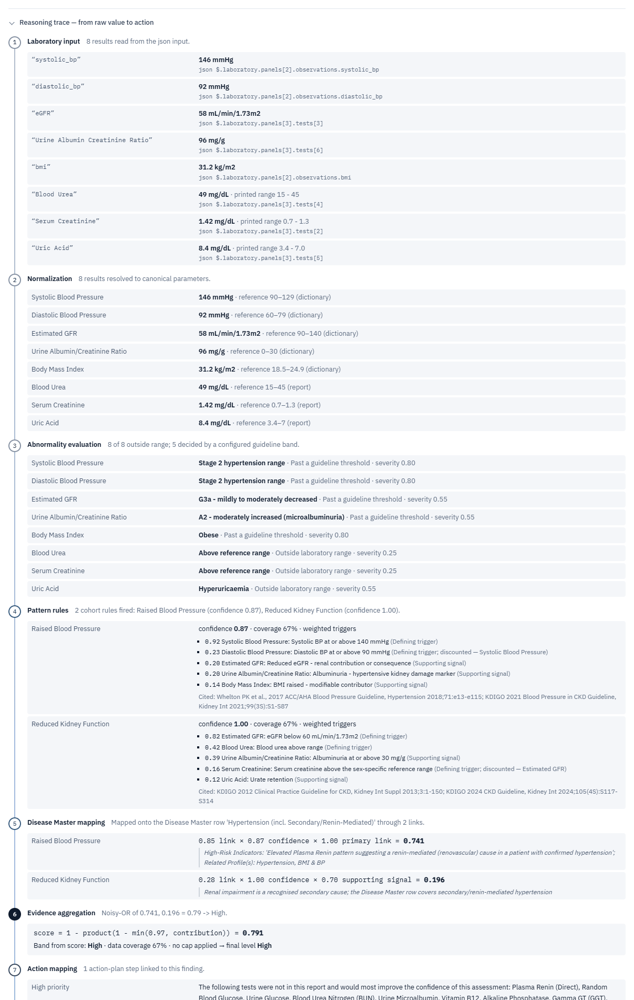
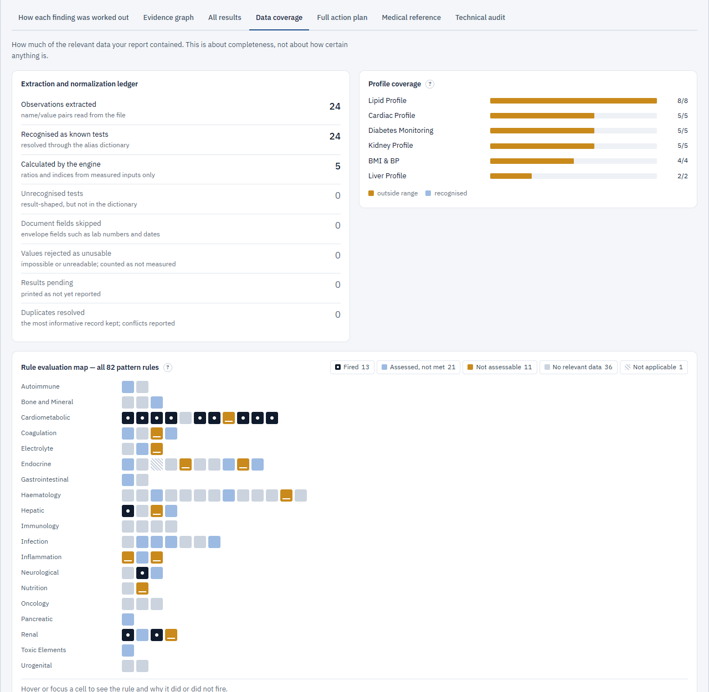
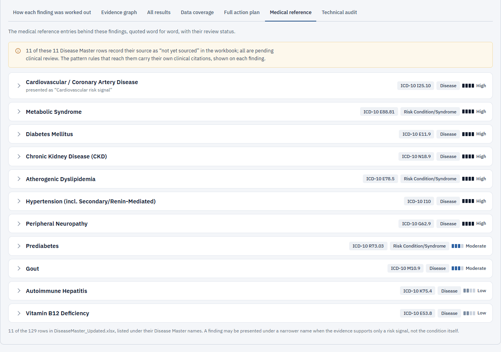
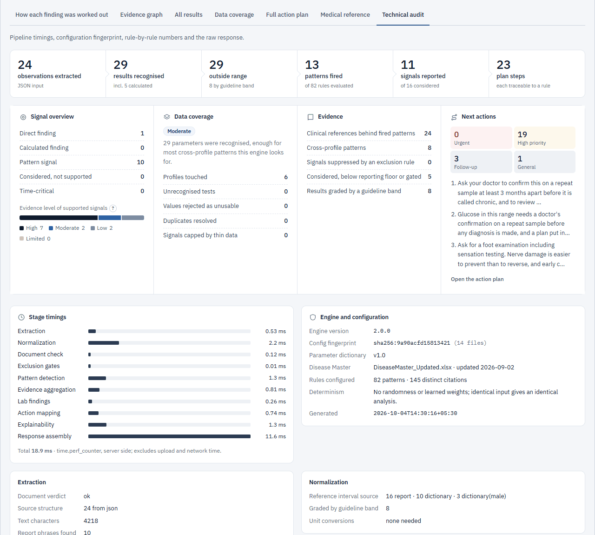
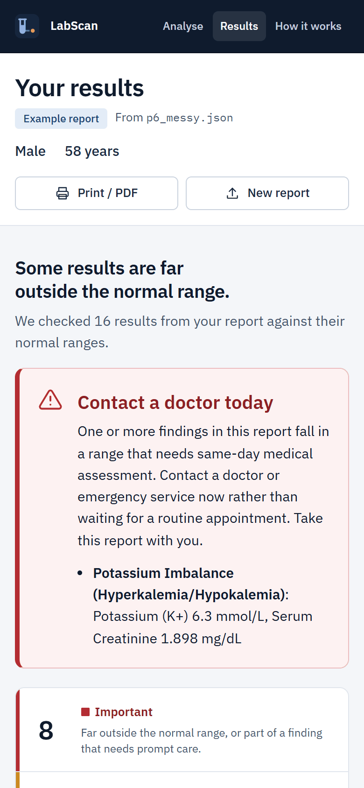

<div align="center">


# LabScan

**LabScan — Explainable Lab Report Analyzer**

*Understand your lab report. Spot what needs attention.*


**Live demo: [labscan-two.vercel.app](https://labscan-two.vercel.app/)**

</div>


> [!IMPORTANT]
> LabScan is an informational and explainability tool. **It does not diagnose, and it is not a
> substitute for professional medical advice.** See the [Disclaimer](#disclaimer).

---

## Overview

A lab report is a page of numbers, units and reference ranges, and most people can't tell
which values matter or what to ask their doctor. LabScan reads the report and answers three
questions in plain language: **what is normal, what needs attention, and what to do next.**

It checks every result against its reference range and looks for patterns across related
tests. It links those patterns to a 129-condition medical reference and shows the complete
evidence trail behind every signal. The reasoning is deterministic and rule-based: the same
report always gives the same answer, and every output traces back to the values and rules
that produced it.

## Key Features

- **Reads real report formats:** PDF (tables and text layer), CSV, TSV, TXT and nested JSON,
  keeping a source path for every value.
- **Normalisation:** 252 lab parameters with 1,094 aliases, unit conversion, sex-aware
  reference ranges, duplicate resolution, and 9 derived values computed only from measured inputs.
- **Plain-language results:** every result is labelled *Important*, *Needs attention* or
  *Normal* and shown beside its normal range with a one-line reason. A same-day alert appears
  when a value needs urgent care.
- **Pattern detection:** 82 rules, each citing its clinical source, look at related tests
  together (for example lipids, or glucose with HbA1c).
- **Explainable evidence:** an interactive **Evidence Graph** and a seven-stage **Reasoning
  Trace** for every signal, from the raw value to the suggested action.
- **Lab Results explorer** with search and filters, a **Data Coverage** map of all 82 rules,
  a prioritised **Action Plan**, the **Clinical Reference** rows quoted verbatim, and a
  **Technical Audit** with measured stage timings.
- **Export:** print or save as PDF (summary or full report), copy a text summary, or
  download the JSON.

## How It Works

```
Lab report → extraction / normalisation → abnormality detection → clinical pattern reasoning
           → evidence aggregation → explainable findings → action plan
```

1. **Extraction** (`engine/extract.py`, `engine/layout.py`) reads each test name, value, unit
   and range from PDF tables and text, CSV/TSV/TXT, or JSON, and records where each value came from.
2. **Normalisation** (`engine/normalize.py`) resolves names and units, picks the reference
   range (the report's own range first), computes derived values, and grades each result.
3. **Document check and exclusion gates** reject files that aren't lab reports. An explicit
   negative test result (for example non-reactive HBsAg) rules its condition out.
4. **Pattern reasoning** (`engine/cohorts.py`) evaluates the 82 cited rules against the
   graded results.
5. **Evidence aggregation** (`engine/risk.py`) maps fired patterns onto the Disease Master
   through 255 weighted links, then pools them per condition with a noisy-OR:

   ```
   contribution = link_weight × pattern_confidence × role_factor × support_penalty
   score        = 1 − Π (1 − min(0.97, contribution))
   ```

   Bands: High ≥ 0.72 · Moderate ≥ 0.48 · Low ≥ 0.28 · Limited ≥ 0.12. Low data coverage
   can only lower a level. The score measures how strongly configured evidence is present;
   **it is not a probability of disease.**
6. **Action plan** (`engine/recommend.py`) builds prioritised next steps from the configured
   guidance. No drug, dose or treatment is ever named.
7. **Explainability** (`engine/explain.py`) builds the evidence graph and the reasoning
   traces only from records the pipeline kept, so nothing in the explanation is inferred
   afterwards.

**Example** (bundled synthetic *Cardiometabolic panel*):
- HbA1c 7.4 % was read from `$.laboratory.panels[1].tests[1]` and fired the cited *Overt
  Hyperglycaemia* rule.
- That rule links to *Diabetes Mellitus* with contribution 0.92 × 1.00 × 1.00 = 0.920.
- Pooled with two weaker patterns (0.242 and 0.210), the score is 0.95, which is **High**.

## Architecture


One FastAPI application (`app.py`) serves both the API (`/api/*`) and the built React
interface (`web/`), so the interface always talks to the API on its own origin. All clinical
knowledge lives in versioned JSON under `config/` and is validated at start-up. There is no
database, and uploads are processed in memory and never written to disk. Module
responsibilities and design trade-offs are described in [`docs/ARCHITECTURE.md`](docs/ARCHITECTURE.md).

## Technical Stack

| Area | Technologies |
|---|---|
| Backend | Python · FastAPI · Starlette · uvicorn · Pydantic · python-multipart |
| Report processing | pdfplumber (PDF tables and text layer) · Python `csv` / `json` · openpyxl (builds the Disease Master JSON from its workbook) |
| Reasoning | Deterministic rule engine in pure Python: cited pattern rules, weighted condition mapping, noisy-OR aggregation. No trained model and no LLM. |
| Frontend | React 19 · TypeScript (strict) · Vite · self-hosted IBM Plex fonts · hand-written CSS (no UI kit) |
| Visualization | Custom evidence graph (layered layout in TypeScript, SVG edges) · CSS range bars · print stylesheet |
| Testing | pytest · httpx (FastAPI TestClient) · Vitest · `tsc --noEmit` · validation scripts in `tools/` |
| Deployment | Vercel (FastAPI preset, `vercel.json`) · Render (`render.yaml`) · Procfile · optional Dockerfile |

Exact versions are pinned in [`requirements.txt`](requirements.txt) and
[`frontend/package.json`](frontend/package.json).

## Project Structure

```
labscan-lab-report-analyzer/
├── app.py              FastAPI app: API routes, upload limits, errors, security headers, serves web/
├── engine/             the analysis pipeline (pure Python, no database)
│   ├── extract.py, layout.py      read PDF / CSV / TSV / TXT / JSON
│   ├── normalize.py               names, units, ranges, derived values, grading
│   ├── cohorts.py                 82-rule pattern engine
│   ├── risk.py                    Disease Master mapping + noisy-OR aggregation
│   ├── recommend.py               action plan
│   ├── explain.py                 evidence graph, reasoning traces, rule audit
│   └── pipeline.py                orchestration and stage timings
├── config/             clinical knowledge as JSON: parameters, rules, Disease Master
├── frontend/           React + TypeScript source (builds into web/)
├── web/                committed production build of the interface
├── samples/            8 synthetic example reports
├── tests/              pytest suites and PDF fixtures
├── tools/              validation and audit scripts
├── docs/               architecture notes and screenshots
├── vercel.json         Vercel configuration (FastAPI preset)
├── render.yaml         Render blueprint
├── requirements.txt    runtime dependencies (requirements-dev.txt adds test tools)
└── DEPLOY.md           deployment guide (Vercel, Render, Procfile hosts, own server)
```

## Local Setup

**Windows (PowerShell).** You need Python **3.11 or 3.12** and Git. Node.js **20.19+** is
needed only if you change the interface, because the built interface is committed in `web/`.

```powershell
git clone https://github.com/A08rpita0/labscan-lab-report-analyzer.git
cd labscan-lab-report-analyzer
py -3.12 -m venv .venv
.\.venv\Scripts\python -m pip install -r requirements.txt
```

Use `py -3.11` instead if that's the version you have. Calling `.venv\Scripts\python` directly
avoids `Activate.ps1`, which PowerShell's default execution policy often blocks. If creating
the virtual environment fails with `WinError 206` (path too long), clone into a shorter
folder such as `C:\src`.

**macOS / Linux:** `python3 -m venv .venv`, then `source .venv/bin/activate` and
`pip install -r requirements.txt`.

No API keys or secrets are needed. Optional settings are read from environment variables:

| Variable | Default | Purpose |
|---|---|---|
| `DRE_MAX_UPLOAD_MB` | `20` (`4` on Vercel) | maximum upload size |
| `DRE_ANALYSIS_TIMEOUT_S` | `60` | time limit per analysis |
| `DRE_LOG_LEVEL` | `INFO` | log level |
| `DRE_ENABLE_OCR` | unset | `1` turns on optional OCR for scanned PDFs (needs extra packages; see `requirements.txt`) |

## Running the Application

The backend serves both the API and the interface:

```powershell
.\.venv\Scripts\python -m uvicorn app:app --port 8000
```

Open **http://127.0.0.1:8000** and choose **Try this example**. Interactive API documentation
is at **http://127.0.0.1:8000/docs**. Main endpoints:

| Method | Path | Purpose |
|---|---|---|
| `GET` | `/api/health` | status, version, configuration fingerprint, upload limit |
| `GET` | `/api/samples` · `/api/samples/{name}` | the bundled synthetic examples |
| `GET` | `/api/config/summary` · `/api/diseases` | rule catalogue, scoring model, Disease Master |
| `POST` | `/api/analyse` | multipart upload: `file`, optional `sex`, `age` |
| `POST` | `/api/analyse/sample` | analyse a bundled example: `file=<sample name>` |

**Changing the interface** (needs Node.js). Keep the backend running on port 8000; the Vite
dev server proxies `/api` to it.

```powershell
cd frontend
npm ci
npm run dev        # http://localhost:5173 with hot reload
npm run build      # type-check, then write the production build into ../web
```

Commit the rebuilt `web/` folder with any interface change.

## Testing

```powershell
.\.venv\Scripts\python -m pip install -r requirements-dev.txt
.\.venv\Scripts\python -m pytest -q             # 327 tests
.\.venv\Scripts\python tools\validate.py        # 7 validation suites
cd frontend; npm ci; npm test; npx tsc --noEmit # 19 unit tests + strict type-check
```

| Check | Result |
|---|---|
| pytest: API contract and every error path, explainability integrity, engine, extraction, edge cases | **327 passed** on Python 3.11 and 3.12 |
| Standalone engine check suites (`tests/test_*.py` run directly) | **1,602 checks passed** |
| `tools/validate.py` | **7 / 7 suites pass**: 9 / 9 clinical cases, 16 / 16 consistency properties, 121 / 121 mappable conditions reachable, 0 dead mappings |
| `tools/recall_audit.py` | 28 / 28 values read and 20 / 20 abnormal results shown in each of 5 PDF layouts |
| Frontend (Vitest) and strict TypeScript | **19 passed**, 0 type errors |

The tests check, among other things, that no evidence-graph edge is invented, and that the
noisy-OR recomputed from each reasoning trace equals the engine's score. Identical input
always gives byte-identical output. All checks use synthetic records and fixtures.

## Vercel Deployment

**Live:** [https://labscan-two.vercel.app/](https://labscan-two.vercel.app/)

LabScan runs on Vercel as **one FastAPI function** that serves both the API and the
interface, exactly as it runs locally. No separate frontend deployment or backend URL is
needed.

| Setting | Value |
|---|---|
| Framework Preset | **FastAPI**, pinned by `vercel.json` |
| Root Directory | `./` |
| Build / install | defaults: dependencies from `requirements.txt`, no Node.js build (`web/` is committed) |
| Python | **3.12**, from `.python-version` (Vercel offers 3.12–3.14, not 3.11) |
| Environment variables | `DRE_MAX_UPLOAD_MB` = `4` (recommended; the only one used) |

To deploy your own copy: push the repository to GitHub, then in Vercel choose **Add New… →
Project** and import it. Keep the detected settings, add `DRE_MAX_UPLOAD_MB=4`, and deploy.
Check `https://<your-project>.vercel.app/api/health`: it should report `"status": "ok"` and
`"max_upload_mb": 4`.

On Vercel, uploads are limited to **4 MB**, because Vercel Functions accept at most 4.5 MB per
request. The interface shows that limit and refuses larger files before uploading. Static
files are served through the function, so the app's security headers apply to them, and the
first request after idle includes a short cold start. Full details are in
[`DEPLOY.md`](DEPLOY.md).

## Render Deployment

`render.yaml` deploys the same app as a long-running uvicorn service on Python 3.11.9 with a
20 MB upload limit. In Render, choose **New → Blueprint**, select the repository, and choose
**Apply**. Railway and other Procfile hosts, your own Linux server, and an optional Docker
image are covered in [`DEPLOY.md`](DEPLOY.md).

## Screenshots

All screenshots come from the LabScan application running the bundled **synthetic** example
reports. No real patient data is included in this repository.

<table>
<tr>
<td width="50%" valign="top"><br><sub><b>Home.</b> Upload a report or try one of eight synthetic examples.</sub></td>
<td width="50%" valign="top"><br><sub><b>What needs attention.</b> Each value beside its normal range, with the reason it was flagged.</sub></td>
</tr>
<tr>
<td width="50%" valign="top"><br><sub><b>Findings.</b> Possible concerns worded as possibilities, each with the results it is based on.</sub></td>
<td width="50%" valign="top"><br><sub><b>Finding explained.</b> Every contribution, the noisy-OR build-up, and the data that is missing.</sub></td>
</tr>
<tr>
<td width="50%" valign="top"><br><sub><b>Evidence Graph.</b> Results → patterns → risk signals → plan steps.</sub></td>
<td width="50%" valign="top"><br><sub><b>Node selected.</b> Its lineage is highlighted; the inspector shows the pooled evidence.</sub></td>
</tr>
</table>

<p align="center"><br><sub><b>Reasoning Trace.</b> Seven stages from the raw value and its source path to the action.</sub></p>

<table>
<tr>
<td width="50%" valign="top"><br><sub><b>Lab Results.</b> Search, filter, and see how each result was graded and what uses it.</sub></td>
<td width="50%" valign="top"><br><sub><b>Data Coverage.</b> The extraction ledger and what happened to each of the 82 rules.</sub></td>
</tr>
<tr>
<td width="50%" valign="top"><br><sub><b>Action Plan.</b> Each step shows why it appears and the results behind it.</sub></td>
<td width="50%" valign="top"><br><sub><b>Clinical Reference.</b> Disease Master rows quoted verbatim, with their review status.</sub></td>
</tr>
<tr>
<td width="50%" valign="top"><br><sub><b>Technical Audit.</b> Pipeline funnel, stage timings and configuration fingerprint.</sub></td>
<td width="50%" valign="top"><br><sub><b>Not a lab report.</b> A clear explanation and the next step, instead of empty results.</sub></td>
</tr>
</table>

<table>
<tr>
<td width="62%" valign="top"><br><sub><b>Print / PDF.</b> The summary on paper; the full report adds every reasoning trace.</sub></td>
<td width="38%" valign="top" align="center"><br><sub><b>Mobile.</b> The same results at phone width.</sub></td>
</tr>
</table>

## Limitations

- **4 MB upload limit on Vercel.** Larger reports need the Render or self-hosted deployment
  (20 MB by default).
- **Clinical content is a draft.**
  - All 129 Disease Master rows are marked *Draft – Pending Clinical Review* in the source
    workbook.
  - 109 of them record their source as "Not yet sourced – AI-drafted from general clinical
    knowledge"; the other 20 cite general references.
  - The 82 pattern rules carry their own clinical citations, but rule weights and thresholds
    are design values.
- **Not clinically validated.** Testing uses synthetic records and fixtures. There is no
  labelled patient dataset, so no sensitivity, specificity or accuracy is claimed.
- **Input limits.** Scanned PDFs need the optional OCR, which is off by default. PDF layouts
  unlike the test fixtures may extract imperfectly, though the results always show what was
  and was not recognised. Reports are expected in English.
- **One report at a time.** There are no trends across reports, and no medication or symptom
  context.
- **Not hardened for multi-user use.** There is no authentication or rate limiting. Nothing
  here establishes HIPAA or GDPR compliance, so don't upload real patient data to a public
  deployment.

## Disclaimer

LabScan is an informational and explainability tool. It shows which laboratory values fall
outside their reference ranges, which configured patterns they match, and why. **It does not
provide a medical diagnosis and is not a substitute for professional medical advice.** Its
scores describe how strongly configured evidence is present, not the probability of having a
condition. Always discuss your results with a qualified clinician.

## Future Improvements

- A clinical review workflow for Disease Master rows and rule weights.
- Trend analysis across several reports from the same person.
- A labelled evaluation set, to measure precision and recall per rule.
- Authentication, rate limiting and audit logging for multi-user deployment.
- A FHIR `Observation` input adapter.
