<div align="center">


# LabScan

**Explainable Lab Report Analyzer**

*Understand your lab report. Spot what needs attention.*


</div>

LabScan reads a laboratory report (PDF, CSV, TSV, TXT or JSON) and checks every result
against its reference range. It looks for patterns across related tests, links them to a
129-condition medical reference, and explains each signal, in plain language for the reader
and as a full evidence trail for the reviewer. The reasoning is deterministic and rule-based:
the same report always gives the same answer, and every output traces back to the values
and rules behind it.

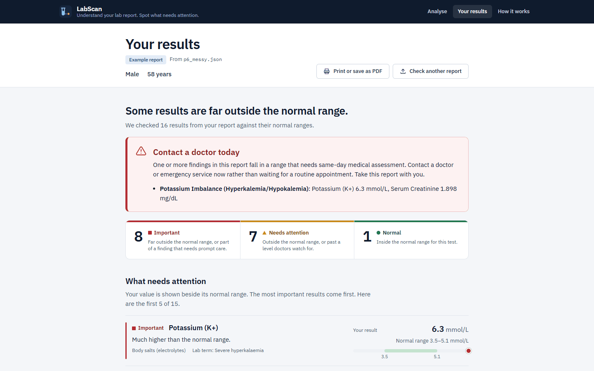

> [!IMPORTANT]
> LabScan provides laboratory analysis, health-related signals, explainable pattern detection
> and configured follow-up guidance. **It is not a diagnostic tool and not a substitute for a
> clinician.** See [Limitations](#limitations-and-disclaimer).

---

## Key features

- **Reads real-world reports:** PDF tables and text layers, CSV/TSV/TXT exports, and
  arbitrarily nested JSON, with a source path kept for every value.
- **Normalises results:** 252 lab parameters with 1,094 aliases, unit conversion, sex-aware
  reference ranges, duplicate resolution, and 9 derived values computed only from measured inputs.
- **Plain-language results:** every result is labelled *Important*, *Needs attention* or
  *Normal*, shown beside its normal range with a one-line reason. A same-day alert appears
  when a value needs urgent care.
- **Pattern detection:** 82 rules, each citing its clinical source, look at related tests
  together (for example lipids, glucose with HbA1c, kidney markers).
- **Explainable evidence:** an interactive **Evidence Graph** and a seven-step **Reasoning
  Trace** for every signal, from the raw value to the suggested action.
- **Data coverage:** an extraction ledger and an evaluation map of all 82 rules, so "no
  signal" is distinguishable from "not enough data".
- **Action plan:** prioritised next steps from the configured guidance, each naming the rule
  and results that produced it. No drug, dose or treatment is ever named.
- **Medical reference and technical audit:** the Disease Master rows behind each finding,
  quoted verbatim, plus measured stage timings and a configuration fingerprint.
- **Export:** print or save as PDF (summary or full report), copy a text summary, or
  download the JSON.

---

## How it works

**In simple terms.** LabScan reads every test result in the file and makes names and units
consistent. It then compares each value with its normal range and checks the results against
82 known patterns. A matching pattern points to conditions in a medical reference list, and
the strength of the evidence for each one is combined. The combined score is lowered when too
little of the relevant data was measured. Finally, LabScan suggests next steps from that
reference, and every step is recorded so that it can be shown.

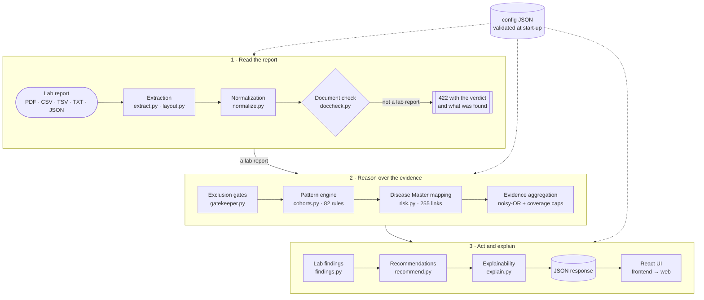

**Scoring.** Each fired pattern contributes to the conditions it is linked to, and the
contributions are pooled with a noisy-OR:

```
contribution = link_weight × pattern_confidence × role_factor × support_penalty
score        = 1 − Π (1 − min(0.97, contribution))
```

- **Role factors:** primary 1.0 · supporting 0.7 · downstream risk 0.6 · differential 0.45.
- **Evidence bands:** High ≥ 0.72 · Moderate ≥ 0.48 · Low ≥ 0.28 · Limited ≥ 0.12.
- **Coverage caps:** low data coverage can only lower a level, never raise it.

The score measures how strongly configured evidence is present. It is **not** a probability
of disease.

All clinical knowledge lives in versioned JSON under `config/` and is validated when the
server starts. [`docs/ARCHITECTURE.md`](docs/ARCHITECTURE.md) covers module responsibilities,
failure handling and design trade-offs.

---

## Main technologies

| Area | Technologies |
|---|---|
| Backend | Python 3.11 · FastAPI · Starlette · uvicorn · Pydantic · python-multipart |
| Report processing | pdfplumber (PDF tables and text layer) · Python `csv` / `json` · openpyxl (builds the Disease Master JSON from its workbook) |
| Reasoning | Deterministic rule engine in pure Python: cited pattern rules, weighted condition mapping, noisy-OR aggregation. No trained model and no LLM. |
| Frontend | React 19 · TypeScript (strict) · Vite · self-hosted IBM Plex fonts · hand-written CSS (no UI kit) |
| Visualization | Custom evidence graph (layered layout in TypeScript, SVG edges) · CSS range bars · print stylesheet |
| Testing | pytest · httpx (FastAPI TestClient) · Vitest · `tsc --noEmit` · validation scripts in `tools/` |
| Deployment | uvicorn · Procfile · Render blueprint (`render.yaml`) · optional Dockerfile |

Exact versions are pinned in [`requirements.txt`](requirements.txt) and
[`frontend/package.json`](frontend/package.json).

---

## Project structure

```
labscan-lab-report-analyzer/
├── app.py              FastAPI service: API routes, upload limits, errors, security headers
├── engine/             the analysis pipeline (pure Python, no database)
│   ├── extract.py, layout.py      read PDF / CSV / TSV / TXT / JSON
│   ├── normalize.py               names, units, ranges, derived values, grading
│   ├── cohorts.py                 82-rule pattern engine
│   ├── risk.py                    Disease Master mapping + noisy-OR aggregation
│   ├── recommend.py               action plan
│   ├── explain.py                 evidence graph, reasoning traces, rule audit
│   └── pipeline.py                orchestration and stage timings
├── config/             clinical knowledge as JSON: parameters, rules, Disease Master
├── frontend/           React + TypeScript source (builds into web/)
├── web/                production build of the interface, served by app.py
├── samples/            8 synthetic example reports
├── tests/              pytest suites and PDF fixtures
├── tools/              validation and audit scripts
├── docs/               architecture notes and screenshots
├── requirements.txt    runtime dependencies (requirements-dev.txt for tests)
├── vercel.json, render.yaml, Procfile   deployment configuration
└── DEPLOY.md           deployment guide (Vercel, Render, Procfile hosts, own server)
```

---

## Local setup (Windows)

**Prerequisites:** Python **3.11** and Git. Node.js **20.19+** is needed only if you change
the interface, because the built interface is already in `web/`.

```powershell
git clone https://github.com/A08rpita0/labscan-lab-report-analyzer.git
cd labscan-lab-report-analyzer
py -3.11 -m venv .venv
.\.venv\Scripts\python -m pip install -r requirements.txt
```

Calling `.venv\Scripts\python` directly avoids `Activate.ps1`, which PowerShell's default
execution policy often blocks. If creating the virtual environment fails with
`WinError 206` (path too long), clone into a shorter folder such as `C:\src`.

On macOS or Linux, use `python3.11 -m venv .venv`, then `source .venv/bin/activate` and
`pip install -r requirements.txt`.

**Configuration.** No API keys or secrets are needed. These optional environment variables
are read at start-up:

| Variable | Default | Purpose |
|---|---|---|
| `PORT` | `8000` | port when deployed (set by Render / Railway) |
| `DRE_MAX_UPLOAD_MB` | `20` (`4` on Vercel) | maximum upload size |
| `DRE_ANALYSIS_TIMEOUT_S` | `60` | time limit per analysis |
| `DRE_LOG_LEVEL` | `INFO` | log level |
| `DRE_ENABLE_OCR` | unset | `1` turns on optional OCR for scanned PDFs (needs extra packages; see `requirements.txt`) |

## Run the backend

The backend serves both the API and the built interface:

```powershell
.\.venv\Scripts\python -m uvicorn app:app --port 8000
```

Open **http://127.0.0.1:8000** and choose **Try this example**. Interactive API
documentation is at **http://127.0.0.1:8000/docs**. Health check:

```powershell
Invoke-RestMethod http://127.0.0.1:8000/api/health     # status: ok, errors: {}
```

Main endpoints: `POST /api/analyse` (multipart upload: `file`, optional `sex`, `age`),
`POST /api/analyse/sample` (`file=<sample name>`), `GET /api/samples`,
`GET /api/config/summary` and `GET /api/diseases`.

## Run the frontend

Only needed when changing the interface. Keep the backend running on port 8000; the Vite
dev server proxies `/api` to it.

```powershell
cd frontend
npm ci
npm run dev        # http://localhost:5173 with hot reload
npm run build      # type-check, then write the production build into ../web
```

Commit the rebuilt `web/` folder together with any interface change.

## Run the tests

```powershell
.\.venv\Scripts\python -m pip install -r requirements-dev.txt
.\.venv\Scripts\python -m pytest -q             # 327 tests
.\.venv\Scripts\python tools\validate.py        # 7 validation suites
cd frontend; npm test; npx tsc --noEmit         # 19 unit tests + strict type-check
```

---

## Example workflow

Using the bundled synthetic *Cardiometabolic panel* (`samples/p1_metabolic.json`):

1. On the home page, choose **Try this example** on *Cardiometabolic panel*.
2. The summary reads **11 Important, 18 Needs attention**. The first result is
   Apolipoprotein B 134 mg/dL against a normal range of 50–100.
3. *What it means* lists the possible concerns, for example *Diabetes Mellitus*, each with the
   results it rests on.
4. **See how this was worked out** opens the reasoning:
   - HbA1c 7.4 % was read from `$.laboratory.panels[1].tests[1]` and graded against the report's range.
   - It fired the cited *Overt Hyperglycaemia* rule.
   - That rule links to *Diabetes Mellitus* with contribution 0.92 × 1.00 × 1.00 = 0.920.
   - Pooled with two weaker patterns (0.242 and 0.210), the score is 0.95, which is **High**.
5. In the **Evidence graph**, selecting *Diabetes Mellitus* highlights every value, pattern
   and plan step connected to it.
6. The **Technical audit** shows the run: 24 observations → 29 results (5 calculated) →
   13 of 82 patterns fired → 11 signals → 23 plan steps, with measured stage timings.
7. **Print or save as PDF** produces a 12-page summary, or a full report with every
   reasoning trace.

---

## Screenshots

All screenshots use the bundled synthetic samples. No real patient data is included in this
repository.

<table>
<tr>
<td width="50%" valign="top">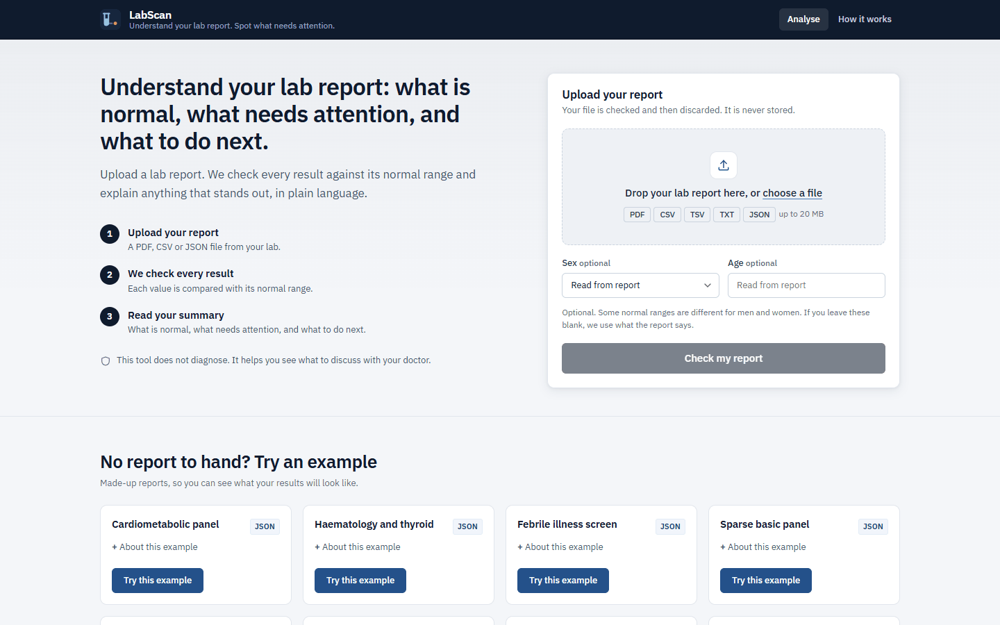<br><sub><b>Home.</b> Upload a report or try one of eight synthetic examples.</sub></td>
<td width="50%" valign="top">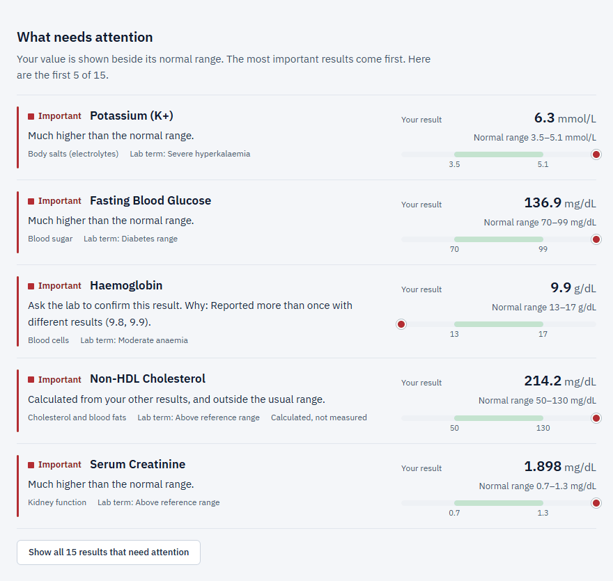<br><sub><b>What needs attention.</b> Each value beside its normal range, with the reason it was flagged.</sub></td>
</tr>
<tr>
<td valign="top">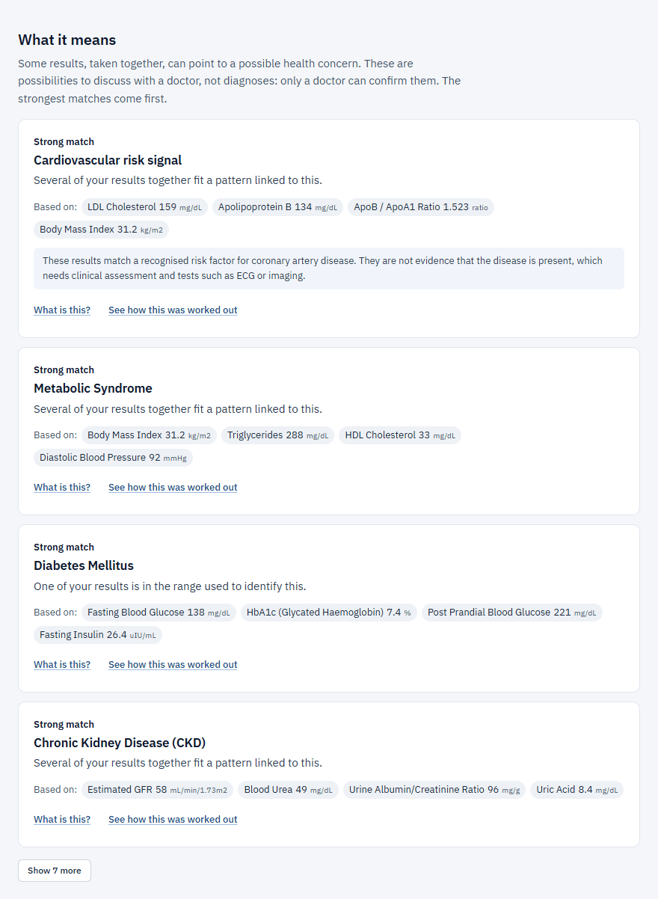<br><sub><b>What it means.</b> Possible concerns worded as possibilities, each with the results it is based on.</sub></td>
<td valign="top">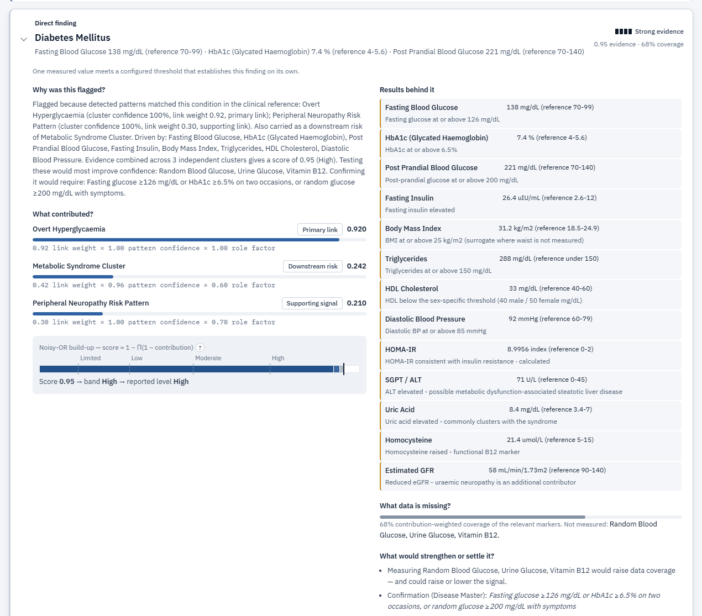<br><sub><b>Finding explained.</b> Every contribution, the noisy-OR build-up, and the data that is missing.</sub></td>
</tr>
<tr>
<td valign="top">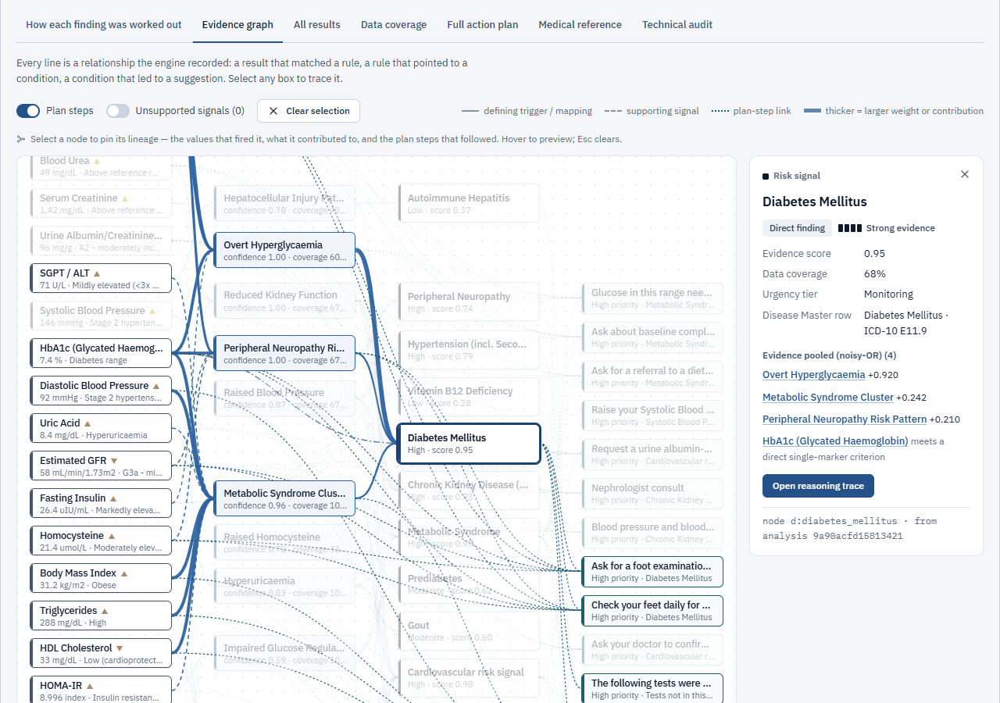<br><sub><b>Evidence graph.</b> Results → patterns → conditions → plan steps; selecting a node highlights its lineage.</sub></td>
<td valign="top"><br><sub><b>Reasoning trace.</b> Seven steps from the raw value and its source path to the action.</sub></td>
</tr>
<tr>
<td valign="top">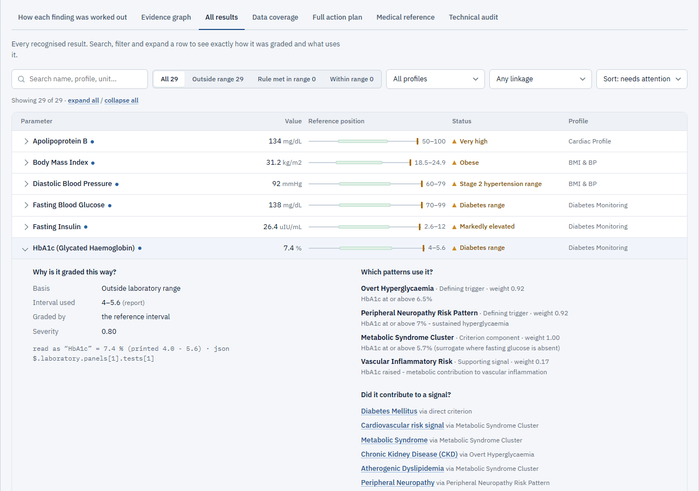<br><sub><b>Results explorer.</b> Search, filter, and see how each result was graded and what uses it.</sub></td>
<td valign="top"><br><sub><b>Data coverage.</b> The extraction ledger and what happened to each of the 82 rules.</sub></td>
</tr>
<tr>
<td valign="top">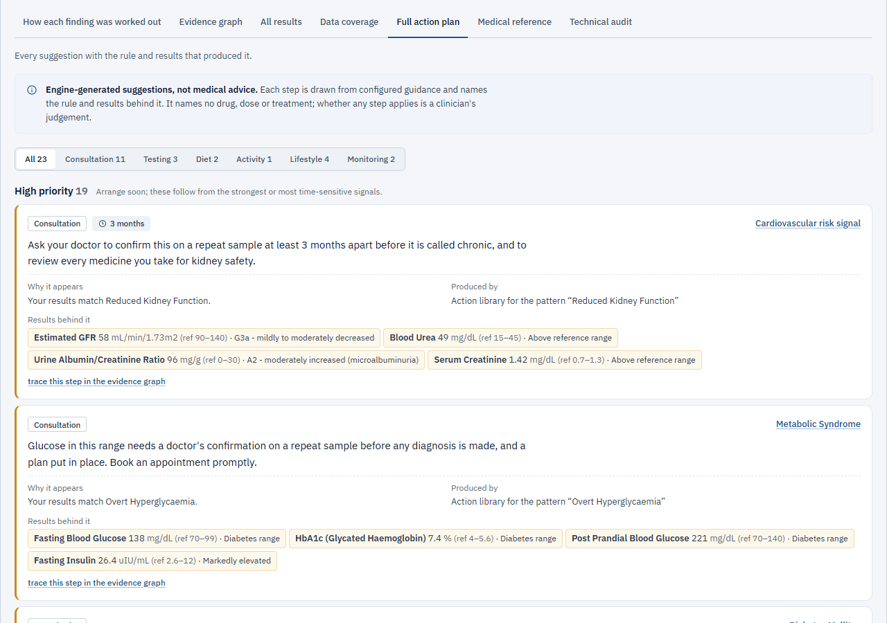<br><sub><b>Action plan.</b> Each step shows why it appears and the results behind it.</sub></td>
<td valign="top"><br><sub><b>Technical audit.</b> Pipeline funnel, stage timings and configuration fingerprint.</sub></td>
</tr>
<tr>
<td valign="top">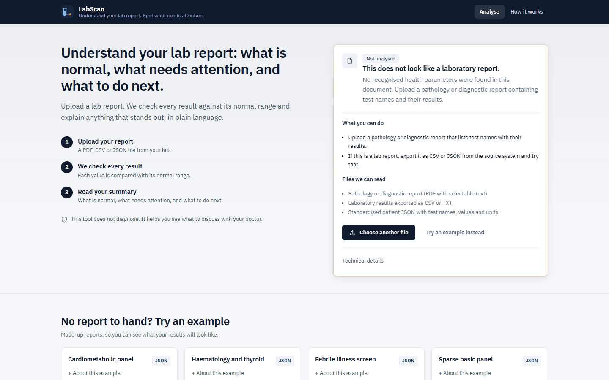<br><sub><b>Not a lab report.</b> A clear explanation and the next step, instead of empty results.</sub></td>
<td valign="top">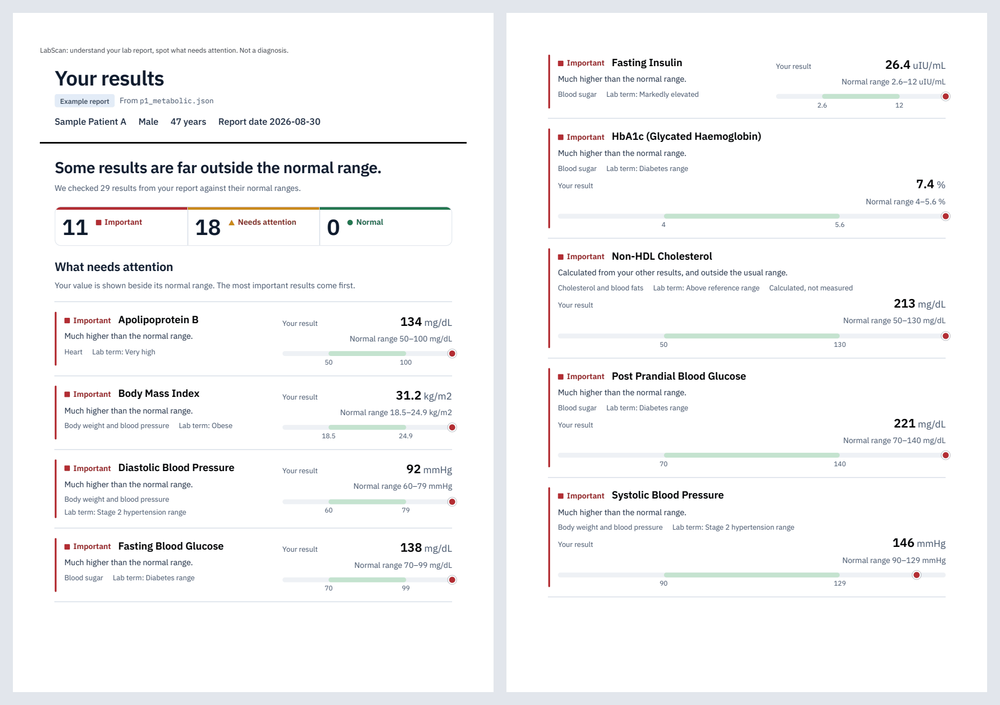<br><sub><b>Print / PDF.</b> The summary on paper; a full report adds every reasoning trace.</sub></td>
</tr>
</table>

<p align="center"><br><sub><b>Mobile.</b> The same results at phone width.</sub></p>

---

## Technical highlights

- **Explainability by construction.** The evidence graph and traces are built only from
  records the pipeline kept (source paths, rule weights, Disease Master links, recommendation
  traces). The tests check that no graph edge is invented, and that the noisy-OR recomputed
  from each trace equals the engine's score for every signal on every sample.
- **Deterministic and auditable.** Identical input gives byte-identical output. Every rule
  cites a clinical source (145 distinct references), and every condition link quotes the
  Disease Master sentence that justifies it.
- **Verified:**
  - 327 pytest tests: API contract and every error path, explainability integrity, the engine,
    extraction, edge cases.
  - 1,602 checks in the standalone engine suites.
  - 7 of 7 validation suites pass, including 9 of 9 hand-built clinical cases (two of them
    negative controls) and 16 of 16 consistency properties (for example, a worsening HbA1c
    never lowers its signal).
  - 121 of 121 mappable conditions are reachable, with 0 dead mappings.
  - 19 frontend unit tests.
- **Robust input handling.** A file that is not a lab report gets a 422 response explaining
  what was found, not an empty "all normal" result. Scanned PDFs are refused rather than
  guessed. Impossible values are rejected and listed, and conflicting duplicates are reported.
- **Privacy-minded service.**
  - Uploads are processed in memory and never written to disk, and there is no database.
  - Logs contain no filenames, patient fields or results, and analysis responses are not cached.
  - Errors use a typed envelope without stack traces.
  - Responses carry a strict Content Security Policy and related security headers.
- **Performance.** On a development laptop the pipeline takes roughly 7–27 ms for the JSON
  and CSV samples and about 110 ms for the two-page PDF. Each response reports its own
  stage timings.

---

## Deployment

**Recommended: Vercel, whole application in one project.**

- **What runs where.** The FastAPI app runs as a single Vercel Function and serves both the
  API (`/api/*`) and the built interface (`web/`), just as it does locally. A separate
  frontend deployment or backend URL isn't needed: the interface calls the API on the same
  origin.
- **How to deploy.** Import the GitHub repository in Vercel and keep the detected settings:
  Framework Preset **FastAPI** (pinned by `vercel.json`), Root Directory `./`, and default
  build and install commands. Dependencies come from `requirements.txt`, and no Node.js build
  runs because `web/` is committed.
- **Environment variables.** None are required. `DRE_MAX_UPLOAD_MB=4` is recommended (see
  below). Optional: `DRE_ANALYSIS_TIMEOUT_S`, `DRE_LOG_LEVEL`.
- **Vercel limitations:**
  - Uploads are limited to **4 MB**, because Vercel Functions accept at most 4.5 MB per request.
    The interface shows that limit and checks it before uploading.
  - Vercel runs **Python 3.12**; it doesn't offer 3.11. The test suite passes on 3.11, 3.12 and 3.13.
  - Static files are served by the function, so the app's security headers apply to them,
    rather than by Vercel's CDN.
  - The first request after idle includes a short cold start.

**Alternative: Render.** `render.yaml` deploys the same app as a long-running uvicorn
service with a 20 MB upload limit. Both setups run the whole app, so no frontend-to-backend
link is needed in either.

Step-by-step instructions for Vercel, Render, Procfile hosts and your own server are in
[`DEPLOY.md`](DEPLOY.md). Docker is optional.

---

## Limitations and disclaimer

- **Not a medical device and not a diagnosis.** LabScan flags laboratory patterns that match
  configured rules. Its scores measure how strongly that evidence is present; they are not
  probabilities of disease. Always discuss results with a clinician.
- **Not clinically validated.**
  - All 129 Disease Master rows are marked *Draft – Pending Clinical Review* in the source
    workbook.
  - 109 of them record their source as "Not yet sourced – AI-drafted from general clinical
    knowledge"; the other 20 cite general references.
  - Rule weights and thresholds are design values.
- **Synthetic validation only.** There is no labelled patient dataset, so no sensitivity,
  specificity or accuracy is claimed.
- **Input limits.** Scanned PDFs need the optional OCR, which is off by default. PDF layouts
  unlike the test fixtures may extract imperfectly, though the report always shows what was
  and was not recognised. Reports are expected in English.
- **One report at a time.** There are no trends across reports, and no medication or symptom
  context.
- **Not production-hardened for multiple users.** There is no authentication or rate
  limiting, and nothing here establishes HIPAA or GDPR compliance.

## Future improvements

- A clinical review workflow for Disease Master rows and rule weights.
- Trend analysis across several reports from the same person.
- A labelled evaluation set, to measure precision and recall per rule.
- Authentication, rate limiting and audit logging for multi-user deployment.
- A FHIR `Observation` input adapter.

